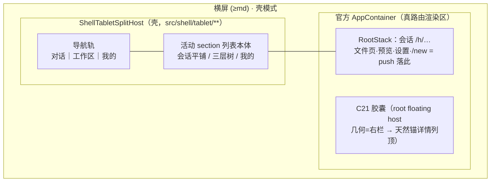

# Paseo Go — 平板横屏结构设计（C29 交付稿）

> 状态：设计定稿（2026-09-27）。裁定权：DESIGN §14.11——本稿即编排者推荐，出稿后直接按 §7 拆实现卡落地（用户预授权），本文档留档事后审；若 §5 触点获准，按 §14.11 增补记入 DESIGN §14 后续条目。
> 基线：分支 `paseo-go/v0.1.0` @ bbb07262。输入：C21 顶栏胶囊（按 C21 卡口径=顶部全宽覆盖官方 header 的形态；现状代码仍为 C14 底部胶囊，本文按"落地形态"对齐）、C26 三层树、C27 文件页三段页签、C17 新建对话直达 `/new`。
> 设备事实：MatePad BRT-W09 物理 1600×2560 @400dpi（`adb shell wm density` 实测 2026-09-27）→ 逻辑 **640×1024dp**：竖屏 640dp=sm=compact，横屏 1024dp=lg=宽屏。断点表 `packages/app/src/styles/unistyles.ts:6-12`（xs 0 / sm 576 / md 720 / lg 992 / xl 1200）；宽屏判定 `useIsCompactFormFactor`（xs/sm=compact，`packages/app/src/constants/layout.ts:42-45`）。

## 0. 推荐案一览

**根级分栏宿主（"根 Stack 双栏化"）**：在官方 `AppShell` 用壳组件 `ShellTabletSplitHost` 包一层（净增 3 行，§5 触点提案）；宽屏+壳模式下渲染 `[导航轨+列表栏（壳）｜ 官方 AppContainer 整棵（右栏）]`。**会话不嵌入、不改路由**——行点击仍走现有 `shellNavigateToAgent` push 真路由，push 屏天然落进右栏；URL、硬件返回、深链、C21 胶囊、已读双拍、预览校验链全部原样保留。竖屏/壳外 = 组件透传 = 零变化。

---

## 1. 目标与非目标

**目标**

1. 横屏（宽屏断点）平板 IM 范式：**导航轨 + 列表栏 + 详情栏** master-detail；会话不再全屏 push（对齐平板微信/飞书，§4）。
2. 消灭现状横屏"三套结构叠罗汉"：壳底部三 tab（竖屏 IA）+ 会话全屏 push + 会话路由上官方 desktop LeftSidebar/桌面 IA 的并置（现状取证 §3.1）。
3. 全部结构决定可回答"手机竖屏为何不受影响"（§6 逐条断言）。
4. 复用官方现成设施：断点 hook、floating-panel 具名宿主、panel-store、C16 双实例 body 模式、C21 胶囊机制——零新轮子、零官方组件代码修改（唯一触点为 §5 包装点）。

**非目标**

1. **不动竖屏/手机形态**（xs/sm）：结构、手势、返回语义、tabBar 全部现状（这是本设计的硬边界，不是"尽量"）。
2. 不动官方 IA（shellMode=false / 官方包）：`ShellTabletSplitHost` 对壳外恒为透传（DESIGN §14.5"壳外零行为变化"同口径）。
3. 不引入桌面交互面：pane 自由拆分/拖拽 tab（`SplitContainer`，web-only，`constants/layout.ts:47-52` 注释明确该能力与平板宽屏布局解耦）。
4. 不重开 C26（三层树本体）/C27（文件页三段页签）/C21（胶囊动作聚合）的卡内口径——本稿只规定它们在宽屏的**落位形态**。
5. 不做应用内自由分栏宽度调节（系统分屏由断点自动塌缩承接，§2）。

## 2. 断点与形态矩阵

| 断点 | 逻辑宽 dp | 典型场景                              | 形态                | 结构                                                                           |
| ---- | --------- | ------------------------------------- | ------------------- | ------------------------------------------------------------------------------ |
| xs   | 0–575     | 手机竖屏；平板 1/2 分屏（512）        | compact             | **现状竖屏壳，零改动**：底部三 tab + 全屏 push + 边缘手势                      |
| sm   | 576–719   | 大屏手机竖屏；**MatePad 竖屏（640）** | compact             | 同上，零改动                                                                   |
| md   | 720–991   | 小平板横屏；大屏手机横屏              | **平板分栏·窄型**   | 轨 56 + 列表 260 + 详情 ≥404                                                   |
| lg   | 992–1199  | **MatePad 横屏（1024）**              | **平板分栏·标准型** | 轨 64 + 列表 300 + 详情 660                                                    |
| xl   | ≥1200     | 大平板横屏                            | **平板分栏·宽型**   | 轨 64 + 列表 300 + 详情 flex（会话内容居中 max 820，`constants/layout.ts:15`） |

- 判定唯一出处 = `useIsCompactFormFactor()`（`constants/layout.ts:42-45`，Unistyles breakpoint 响应式 hook，转屏自动重渲染）。分栏激活条件再与 `useShellSeam().active` 相与（`src/shell/use-shell-seam.ts:25-43`，含 F2 rehydration 门）。
- **决策点 D-T1（≥md 即分栏，不加设备类型判定）**：横屏手机（≥720dp）同样吃到分栏。理由：①单一规则优于"平板且横屏"的启发式；②md 窄型详情仍有 404dp（官方桌面中心列下限 `MIN_DESKTOP_CENTER_WIDTH=400`，`components/desktop-sidebar-layout.ts:4`）；③微信横屏手机虽保持单列，但其列表在 400+dp 详情旁同样成立。若事后用户否决，回退=激活条件加一个宽度常量（§6 R-6）。
- **转屏行为**：分栏宿主是纯渲染层，**不触导航栈**——横屏右栏中的会话，转竖屏后仍是栈顶路由 → 全屏 push（现状形态），转回横屏自动回到右栏；轨选中/列表选中态由路由派生（§3.2），旋转往返自动恢复。系统分屏半屏（<720dp）自动塌缩回 tab 形态，与微信"窄窗收单列"语义一致。

## 3. 结构定稿

### 3.1 现状事实（读码取证，宽屏为什么"乱"）

1. **壳 tab 页在宽屏没有官方侧栏**：`AppWithSidebar` 的 chrome 白名单只含 `/open-project`、`/new`、`/sessions`、`/schedules` 与已知 host 路由（`app/_layout.tsx:862-878`），`/chats` 等壳路由 `chromeEnabled=false` → LeftSidebar `mounted=false`（`_layout.tsx:521,539-545,629-648`）。宽屏看到的=全宽底部三 tab（竖屏 IA 拉伸）。
2. **会话路由在宽屏挂出官方 desktop 面**：`/h/<sid>/workspace/<wid>` 命中白名单 → LeftSidebar 挂载且 `useLatchedBoolean` 粘滞不卸（`_layout.tsx:486`）；native 默认关闭（`DEFAULT_DESKTOP_OPEN = isWeb`，`stores/panel-store/index.ts:112`）。同时 `WorkspaceScreen` 宽屏形态=官方 header（`shouldShowWorkspaceScreenHeader = !focusMode || isMobile` 恒可见，`screens/workspace/workspace-screen.tsx:1378-1383`）+ desktop tab 行（native 无 pane-split 走 fallback，`workspace-screen.tsx:3491-3494,4065-4091`；`supportsDesktopPaneSplits()=isWeb`，`constants/layout.ts:50-52`）+ 壳胶囊浮层——即"桌面 app 硬塞进平板"。
3. **会话打开机制（本设计的关键输入）**：行点击 → `shellNavigateToAgent`（`src/shell/chats/shell-navigate-to-agent.ts:38-52`，动词= `router.push`）→ 官方根路由 `/h/<sid>/workspace/<wid>?open=agent:<aid>`（`src/shell/routes.ts:79-80`；builder `utils/host-routes.ts:362-373`）→ 根 Stack 全屏 push。**会话是根 Stack 上的真路由**，不是可搬运的组件——"渲染进右栏"的本质问题=根 Stack 的渲染区在哪。
4. 官方宽屏设施可用性：`SplitContainer`=web-only（dnd-kit，见上）；floating-panels=具名宿主机制（`components/ui/floating-panel-portal.tsx:12-51`，WorkspaceScreen 已示范按区域挂具名宿主，`workspace-screen.tsx:4106-4111`）；官方 desktop 三栏=sidebar 行在 `AppContainer` 内（`_layout.tsx:550-571`）。

### 3.2 推荐案 T-A：根级分栏宿主（根 Stack 双栏化）

**结构**：`AppShell`（`_layout.tsx:929-942`）中用 `ShellTabletSplitHost` 包住 `AppWithSidebar`（=包住整个 `AppContainer`）。宿主三态：

- **透传态**（xs/sm，或 `useShellSeam` 非 active，或 full-bleed 路由）：`return children`，DOM 树与现状完全一致。
- **分栏态**（≥md 且壳模式）：`row [ TabletNavColumn(固定) | children(flex:1) ]`。
- full-bleed 白名单（纯函数，`pathname` 派生）：`/welcome`、`/pair-scan`——onboarding/配对不属于 IM 主界面，保持全窗。

**左栏 TabletNavColumn**（新目录 `src/shell/tablet/**`）：

1. **导航轨（三 tab 去向）**：竖排三目的地（对话/工作区/我的），复用 `SHELL.chats/workspace/me` 路由串（`routes.ts:13-22`）+ 现有 tab 图标组件（`(shell)/_layout.tsx:41-51`）；点击= `router.navigate` 到对应 tab（expo navigate 对已挂载 tab 的语义=切 tab 并弹掉其上 push，正好替代"tab 间不叠栈"§3）。**宽屏隐藏底部 tabBar**：`(shell)/_layout.tsx` wide 分支给 `screenOptions.tabBarStyle={display:"none"}`——Tabs 路由骨架、隐藏屏（files/commands/import，`(shell)/_layout.tsx:82-85,95-97`）与 `lastFocusedTab` 恢复机制（`(shell)/_layout.tsx:25-28`）全部不动。
2. **活动 section 列表本体**：chats 平铺列表 / workspace 三层树（C26）/ me 概览+设置行，以**双实例 body 组件**挂入（先例=C16 `src/shell/components/files-screen-body.tsx`，commit d1b9596d）：屏组件抽出 body，tab 屏与左栏各挂一次。section 归属=`pathname → section` 纯映射（`/chats`→对话；`/files/*`、`/workspace`→工作区；`/import`、`/commands/edit`、`/h/…`→维持上一 section，宿主 ref 记忆）。
3. 列表行点击 handler **零改动**（宽竖屏同一份代码）：会话行= `shellNavigateToAgent`、L2= `shellFilesHref`、＋新建对话= C17 的 `/new` push。

**右栏 = 官方 AppContainer 整棵**（根 Stack 的唯一渲染区）：

- **会话在右栏渲染的具体机制（正面回答）**：行点击 → 现有 push 把 `/h/<sid>/workspace/<wid>?open=agent:<aid>` 压上根 Stack → 该屏在右栏 flex 区内渲染。**不嵌入组件、不伪造 PaneContext、不改路由**：URL 真实变化（深链 `paseogo://` 与冷启动恢复原样可用）、硬件返回=官方 pop（落回 chats 占位屏，列表栏不动——即微信"返回关详情保列表"）、open-intent 消费/清理与 deck 保留（`h/[serverId]/workspace/[workspaceId]/index.tsx:79-319`）全部官方原样。
- **占位屏**：分栏激活时 `chats/workspace/me` tab 屏渲染"选择会话"空态（微信"未选择聊天"同构）而非列表本体（列表已在左栏）。
- **工作区三层树与文件页落位**：左栏=三层树 body；L2 点行体→文件页 push→右栏（C27 `文件|diff|git` 三段页签原样，右栏 660dp 容得下）；L3→会话→右栏。文件页在右栏即现屏，无宽屏分支。
- **「我的」形态**：左栏=me body 列表；官方设置/ host 设置 push→右栏。官方 settings 桌面分栏需 ≥720dp 共享宽（`SETTINGS_DESKTOP_SPLIT_MIN_WIDTH`，`constants/layout.ts:20-23`；`canDesktopAppSidebarShare` `components/desktop-sidebar-layout.ts:69-81`），右栏 660dp 下自动单列——官方降级逻辑，壳零工作。
- **C21 胶囊宽屏形态**：root floating host（`content-floating-panels`，`_layout.tsx:593`）在 AppContainer 内 → 分栏后其 absoluteFill 几何=**右栏** → 顶部全宽胶囊天然成为**详情列头**（覆盖右栏内官方 header，含其汉堡=不可达，与 C21"覆盖官方 header 控件不可达=预期"同口径）。`session-header/visibility.ts` 纯谓词扩一个 `isCompact` 入参：**胶囊宽屏保留**（它就是详情头），**左缘返回滑动带 compact-only**（宽屏有轨+可见返回键；mobile-panels 开栏手势本就 compact-only，`_layout.tsx:620-624`，C21 blocker 在宽屏无副作用）。
- **官方 LeftSidebar**：native 默认关（`panel-store/index.ts:112`）；其 toggle 在官方 header 内被胶囊覆盖不可达 → 宽屏稳定为"轨+列表+详情"三列，不出现第四列。无需任何 store 操纵。
- **选中态单一真相**：行高亮=（栈顶为会话路由）且（行 agentId === `sessions[serverId].focusedAgentId`）——后者即 `visibility.ts:12-18` 钉死的官方唯一活源；不新增选中 store。

**代价**：① 新上游触点 1 处（§5，净增 3 行）；② body 抽取 ×3 + 占位分支 ×3（C31，壳域重构，有 C16 先例）；③ 转屏/冷启动证据矩阵（C30/C32）。

**竖屏为何不受影响**：激活条件含 `!useIsCompactFormFactor()`——竖屏恒走透传分支，返回的 JSX 与现状逐字节相同；seam 三行是透明包装（children 直通）；`(shell)/_layout` 的 tabBar 隐藏与 tab 屏占位分支都只挂在 wide 条件上；visibility 谓词对 compact 传入的分支=现状返回值。

### 3.3 备选 T-B：(shell) 组内双栏 + 官方面板嵌入（零触点）——仅作回退案

机制：`(shell)/_layout` wide 分支自绘 `[轨+列表｜详情栏]`，详情栏直接挂官方 `AgentConversationPanel`（`panels/agent-panel.tsx:425-434`），用 `PaneProvider/PaneFocusProvider`（`panels/pane-context.tsx:9-25,51-69`，`PaneContextValue` 含 8 个必给回调）伪造面板上下文，并复刻 `WorkspaceScreen` 的上下文层（`WorkspaceFocusProvider`+`DiffDocumentWorkspaceCacheProvider`+`NewTabLauncherProvider`，`workspace-screen.tsx:1302-1327`）与 `buildWorkspacePaneContentModel` 装配（`screens/workspace/workspace-pane-content.tsx:43-82,91-164`）。`SplitContainer` 本身不可用（web-only，§3.1-4），分栏行是壳自绘（小项）。

**对缝隙预算的冲击=零上游行，但冲击转嫁为行为面**：

- URL 不反映会话 → 深链/冷启动恢复、C21 可见性谓词（以根路由栈为口径，`visibility.ts:40-48`）、硬件返回（需自挂 BackHandler 栈）、进入清未读的双拍、F6b 预览 root 校验链（route 参数优先链）全部要在壳侧**平行实现一遍**——每一条都是与官方行为漂移的面。
- 面板装配是官方路由的**私有契约**：上游重构 pane-content model / descriptor 字段即打断嵌入点；merge 纪律从"缝隙文件 30 秒解缝"退化为"影子路由常驻跟进"。
- 若改为整嵌 `WorkspaceScreen`（`workspace-screen.tsx:855` 导出组件，props 仅 `{serverId,workspaceId,isRouteFocused,recoveryRequested}`）：仍需在壳侧重做路由文件的 open-intent 消费、`useActiveWorkspaceSelection` 接线与 deck 保留（`h/[serverId]/workspace/[workspaceId]/index.tsx:96-319`）≈复刻路由，且宽屏桌面 IA（tab 行/终端）原样进右栏，与 IM 范式更远。

**结论**：唯一优点=零触点；§5 触点被否决时启用，实现卡预算按上表逐项加计。

### 3.4 否决 T-C：官方 LeftSidebar 复用改造

把壳列表塞进官方 desktop 侧栏（或改 `AppContainer` 挂载条件）=直接编辑上游 `components/left-sidebar.tsx`（988 行）/`_layout.tsx` 挂载逻辑，数十行、每次 merge 复发冲突，远超触点预算；且官方侧栏 IA（项目树）≠壳 IA（跨主机会话平铺+置顶/归档/未读），"复用"实为重写；侧栏行在 AppContainer 内还导致胶囊几何、full-bleed 全部要再破一层。**否决**。

### 3.5 否决变体：分栏包在 AppContainer children 内（`_layout.tsx:563/568` 的 children 位）

官方 sidebar 行会落在分栏**外侧**（会话路由上可再叠出第四列），且 root floating host（`_layout.tsx:593`）仍全窗——C21 顶部全宽胶囊会盖住左栏列表头。要修正必须再动 AppContainer 内部=触点扩大。**否决**（记录为决策痕迹：包装点必须在 AppContainer 之外）。

## 4. 微信 / 飞书对齐点清单

| #   | 对齐点             | 微信/飞书平板行为                                       | 本案落点                                                                                                                                                                                                                                    | 竖屏影响                   |
| --- | ------------------ | ------------------------------------------------------- | ------------------------------------------------------------------------------------------------------------------------------------------------------------------------------------------------------------------------------------------- | -------------------------- |
| 1   | 列表选中态         | 选中会话持久高亮（微信灰底/飞书蓝底），单一真相、点即切 | 路由派生高亮（§3.2 选中态），无本地双源                                                                                                                                                                                                     | 无（compact 无选中态概念） |
| 2   | 未读               | 进入会话即清；打开中的会话列表不再翻未读                | 现行为已满足：点击行 markRead 双拍（`chats.tsx:5-7` 头注）+ C18 完结制                                                                                                                                                                      | 无                         |
| 3   | 返回语义           | 返回关闭详情、列表原位；切导航项不吃返回栈              | 根 Stack pop→占位屏；轨=navigate 到已挂 tab 自带弹栈                                                                                                                                                                                        | 无（竖屏=现状全屏 pop）    |
| 4   | 键盘避让           | 键盘只压详情列，列表列纹丝不动                          | 全局无 KeyboardAvoidingView（grep 0 命中）；官方 composer 自管键盘位移（`KeyboardShiftProvider`，`_layout.tsx:91`）→ 结构性成立；C32 真机实测钉死（含百度输入法/ADBKeyboard 双路径）                                                        | 无                         |
| 5   | 分栏比例与最小宽度 | 列表 ~300dp 定宽；聊天列 ≥420dp                         | 轨 56(md)/64(lg+)；列表 260(md)/300(lg+)（官方 sidebar 默认 320/范围 200–600，`stores/panel-store/state.ts:24-26`，取窄值给详情让宽）；详情 min 400（`desktop-sidebar-layout.ts:4` 同值）；会话内容居中 max 820（`constants/layout.ts:15`） | 无                         |
| 6   | 列表塌缩阈值       | 窄窗/分屏收单列                                         | <720dp=compact=现状 tabs（§2 矩阵）                                                                                                                                                                                                         | 无                         |
| 7   | 长按菜单           | 锚定 popover，不随列表滚动漂移                          | C19 popover；菜单层=窗口级 Modal（`components/ui/menu/menu-overlay.tsx:170-173` measureInWindow+statusBarTranslucent 口径）→ 跨列定位天然正确                                                                                               | 无                         |
| 8   | 导航轨重复点击     | 点当前项=回顶部/刷新                                    | 轨点击=navigate 已挂 tab；同 section 再点=列表 scrollToTop（C31 验收项）                                                                                                                                                                    | 无                         |
| 9   | 空态               | 详情列"未选择聊天"引导                                  | 占位屏（§3.2），复用壳空态 icon+引导范式（C12）                                                                                                                                                                                             | 无                         |
| 10  | 双栏下新建         | ＋在列表列头，产物落详情列                              | chats 头 ＋→C17 `/new` push→右栏；返回=pop 回占位屏                                                                                                                                                                                         | 无                         |

## 5. 上游触点提案表（显式提案，未获批不得发生）

| 项         | 内容                                                                                                                                                                                                                                              |
| ---------- | ------------------------------------------------------------------------------------------------------------------------------------------------------------------------------------------------------------------------------------------------- |
| 文件       | `packages/app/src/app/_layout.tsx`（既有官方文件，非既有 6 文件预算内）                                                                                                                                                                           |
| 位置       | `AppShell`（`_layout.tsx:929-942`）                                                                                                                                                                                                               |
| 改动       | `+import ShellTabletSplitHost from "@/shell/tablet/split-host"`（1 行）；用 `<ShellTabletSplitHost>` 包住 `<AppWithSidebar>…</AppWithSidebar>`（开/闭 2 行，内部 4 行仅重缩进零语义）。**净增 3 行，diff ≈11 行，预算 ≤10 净增行**。              |
| 理由       | 双栏必须包住 AppContainer **整体**才能同时满足：①会话保持真路由（§3.2 机制成立的前提）；②root floating host/C21 胶囊自动获得右栏几何；③官方 LeftSidebar 行被收进右栏不产生第四列。children 内包装（§3.5）与零触点嵌入（§3.3）均已被结构理由否决。 |
| 解缝口径   | 单一包装点、零逻辑；`git merge upstream/main` 时若上游改 AppShell，冲突解法=把包装重新贴到新版结构上（DESIGN §2.7"重新贴缝"原则，与 `index.tsx` 缝隙同款操作，30 秒级）。宿主本体全在 `src/shell/tablet/**`（§2.2 域），永不冲突。                |
| 壳外零变化 | compact / shellMode=false / 官方包（`useShellSeam().active=false`，含 F2 rehydration 门）→ 组件直通 children。                                                                                                                                    |
| 回退案     | 触点被否决 → §3.3 T-B（零触点嵌入，代价清单见该节）；实现中失控 → 删 3 行即回到现状（§6）。                                                                                                                                                       |
| 备案       | 获准后按 DESIGN §14.11 由编排者增补记入 §14 后续条目。                                                                                                                                                                                            |

**本设计仅此一个新触点。** T-B/T-C 的触点面（零 / 数十行）已在 §3.3/§3.4 对比。

## 6. 迁移与回退

**竖屏零回退断言（逐决定）**：

| 结构决定        | 竖屏（xs/sm）为何不受影响                                                                  |
| --------------- | ------------------------------------------------------------------------------------------ |
| 根级分栏宿主    | `!isCompact` 是激活前置；compact 下 `return children`，渲染树与现状同构                    |
| seam 3 行       | 透明包装，无条件分支参与                                                                   |
| tabBar 宽屏隐藏 | 分支条件=wide；compact 的 `screenOptions` 逐字不动                                         |
| tab 屏占位分支  | 条件=分栏激活；compact 渲染完整列表 body（抽取式重构不改行为，C16 同款验收：竖屏截图对照） |
| 选中态/轨派生   | 仅左栏消费；compact 不渲染左栏                                                             |
| C21 谓词扩参    | compact 传入下返回值与现状谓词逐桶相等（既有 9 条单测保锚 + 新增 wide 桶）                 |
| 分栏比例常量    | 壳侧新常量文件，竖屏无消费方                                                               |

**回退路径**：① 运行时=我的→壳模式关（直通官方 IA，现状能力）；② 代码=删 seam 3 行（宿主文件可留置无害）；③ 数据=**不新增任何持久态**（轨选中/占位/比例全为屏内态或路由派生；刻意**不加**"分栏开关"设置项——断点即裁定，少一个旋钮少一类漂移）。

**风险清单**：

- **R-1 React Compiler memo（R1 族，BUILD.md 已知问题#5）**：宿主/选中态/轨派器禁用 `void version` 类重算信号；一律 zustand selector + `useUnistyles()` breakpoint hook 订阅；派生逻辑做纯函数+单测（`visibility.ts` 姿势）。
- **R-2 Unistyles 冷启动 KI3 族**（`todo/KI3-coldstart-tabbar-dark.md`）：冷启动横屏首帧 breakpoint/主题竞态 → 宿主激活与 `useShellSeam.pending` 同型门控（failsafe 姿势 `use-shell-seam.ts:8-16`）；C30 验收含"冷启动横屏 ≥2 张 + 暗色"。
- **R-3 Portal 层序**：root floating host 右栏几何=设计而非事故（§3.2）；左栏浮层若实测有组件按"宿主覆盖自身"做相对测量 → 官方具名宿主机制给左栏单挂一个（`floating-panel-portal.tsx:13,39-51`，先例 `workspace-screen.tsx:4106-4111`），壳域一行；C19 菜单=窗口级 Modal 不受影响（§4-7）。
- **R-4 AppContainer 视口数学**：`viewportWidth` 取窗口宽而非右栏宽（`_layout.tsx:470`），官方 sidebar `canShare` 判定在分栏下偏乐观——但 native 默认关且 toggle 被胶囊覆盖（§3.2），影响面≈0；记 known_issue，C32 真机确认无意外开栏路径。
- **R-5 性能/内存**：左栏列表在会话打开时常驻——与现状等价（列表本就挂在被覆盖的 tab 屏内）；deck 保留逻辑在路由文件，路由未动（`h/[serverId]/workspace/[workspaceId]/index.tsx:196-319`）。
- **R-6 横屏手机行为变化**（D-T1 的代价面）：≥720dp 手机横屏从"tab+全屏 push"变分栏。接受；若用户否决，激活条件加宽度阈值常量（一处改动，卡片 C30 预留常量位）。

## 7. 拆卡草案（供编排者直接立项；依赖 C30→C31→C32，且 C31 排在 C17/C26 之后——同文件）

| 卡                       | 范围与文件域                                                                                                                                                                                                                                     | 验收要点（四项契约裁剪）                                                                                                                                                                                                                                              |
| ------------------------ | ------------------------------------------------------------------------------------------------------------------------------------------------------------------------------------------------------------------------------------------------ | --------------------------------------------------------------------------------------------------------------------------------------------------------------------------------------------------------------------------------------------------------------------- |
| **C30 平板分栏骨架**     | `app/_layout.tsx`（§5 seam，≤10 净增行）；新目录 `src/shell/tablet/**`（split-host / nav-rail / section-derivation / full-bleed 谓词，纯函数+单测）；`(shell)/_layout.tsx`（wide tabBar 隐藏 + SplitContext）；右栏占位屏组件；`shell/locales`。 | 门禁零错；纯函数单测（激活三态/section 映射/full-bleed）；真机：MatePad 横屏=轨+占位三列、竖屏与基线**截图逐屏对照零差异**、转屏往返栈保留、冷启动横屏暗色（R-2）、官方包（壳关）零变化；读图 ≥6。                                                                    |
| **C31 双栏接线与选中态** | `(shell)/chats.tsx`、`workspace.tsx`、`me.tsx`（body 抽取×3 + 占位分支）；`src/shell/components/*-screen-body*`×3（C16 模式）；`src/shell/tablet/**`（列表栏挂载、选中态派生、轨 scrollToTop）。                                                 | 门禁零错；定向套件绿（routes/derive/既有 body 测试）；真机横屏：点会话→右栏会话+行高亮+未读清、L2→文件页右栏、L3→会话、返回→占位且列表原位、＋→`/new` 右栏、轨三切+重复点回顶、深链 `paseogo://` 冷启动落右栏；竖屏全量回归零差异；读图 ≥8。                          |
| **C32 详情列形态收尾**   | `src/shell/session-header/**`（谓词扩 isCompact：胶囊 wide 保留、边缘返回带 compact-only）；`src/shell/tablet/**`（比例常量/最小宽/安全区）；`(detail)/**` 接线级。                                                                              | 门禁零错；visibility 单测扩 wide 桶（既有桶逐值不变）；真机矩阵：C21 胶囊右栏全宽顶覆盖（亮+暗）、边缘返回带横屏失效/竖屏原样、文件页三段页签与预览横屏形态、键盘避让实测（列表列不动）、settings 右栏单列形态、md 窄型（720–991）实测、R-4 无意外开栏确认；读图 ≥8。 |

三卡各自恰好一次 commit、定向测试口径同批（禁全量）。W1 stash 对照批尾统一执行。

---

## 附 A：本文引用的官方设施（点名出处汇总）

| 设施                           | 出处                                                                                                                          | 用法                         |
| ------------------------------ | ----------------------------------------------------------------------------------------------------------------------------- | ---------------------------- |
| 断点/宽屏判定                  | `styles/unistyles.ts:6-12`；`constants/layout.ts:42-45`                                                                       | 形态矩阵唯一判据             |
| 根 Stack 与 chrome 白名单      | `app/_layout.tsx:862-917,929-942`                                                                                             | seam 包装点；现状取证        |
| root floating host（具名宿主） | `app/_layout.tsx:593`；`components/ui/floating-panel-portal.tsx:12-51`                                                        | C21 胶囊右栏几何；R-3 预案   |
| 会话打开链                     | `src/shell/chats/shell-navigate-to-agent.ts:38-52`；`utils/host-routes.ts:362-373`；`src/shell/routes.ts:76-81`               | 右栏渲染机制=真路由 push     |
| 会话屏宽屏形态与 header        | `screens/workspace/workspace-screen.tsx:1378-1383,3491-3494,4065-4091`                                                        | 现状取证；胶囊覆盖对象       |
| 面板装配（T-B 用）             | `panels/agent-panel.tsx:425-434`；`panels/pane-context.tsx:9-25`；`screens/workspace/workspace-pane-content.tsx:43-82,91-164` | 回退案成本核算               |
| 官方侧栏开关                   | `stores/panel-store/index.ts:112,129-131`；`components/desktop-sidebar-layout.ts:4,65-81`                                     | 第四列免疫；R-4              |
| 边缘手势                       | `mobile-panels/provider.tsx:55,265-273`；`app/_layout.tsx:620-624`                                                            | C21 blocker 宽屏无副作用论证 |
| 双实例 body 先例               | `src/shell/components/files-screen-body.tsx`（C16，commit d1b9596d）                                                          | C31 抽取模式                 |
| 菜单窗口级 Modal               | `components/ui/menu/menu-overlay.tsx:170-173`                                                                                 | §4-7 跨列定位论证            |
